# Laravel From Scratch

## My first commit
Archivos base para empezar el curso LFTS a partir de la Section 2

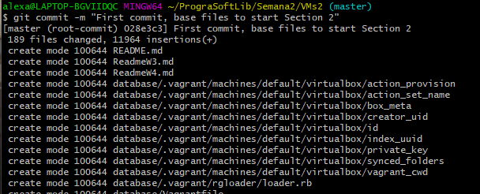

## Include CSS and Javascript
Modificamos el welcom.blade.php que cargaba la vista basica de laravel creando nuestro propio código

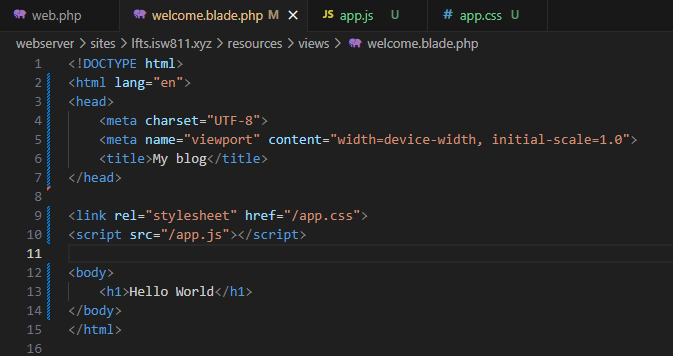

Agregamos un archivo app.css para dar estilo por medio de css

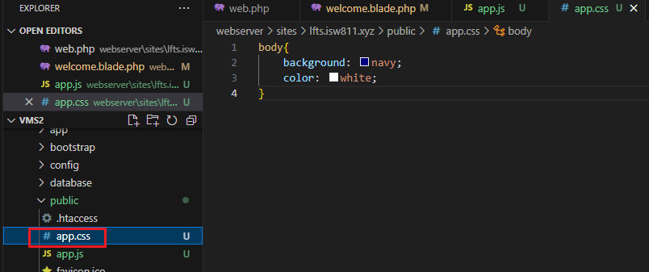

Agregamos un archivo app.js para crear código javascript

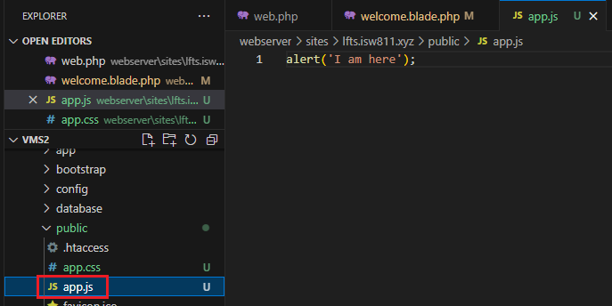

## Make a Route and Link to it
Modificamos el nombre de la vista en la carpeta views y el llamado en el archivo web.php de la carpeta routes

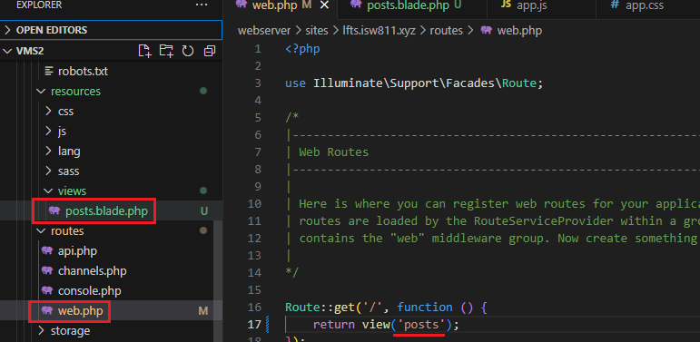

Cambiamos el contenido del html de posts.blade.php

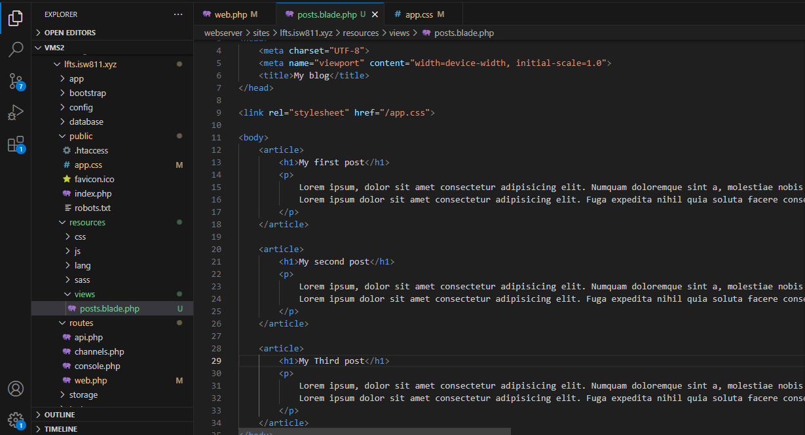

Junto con el css

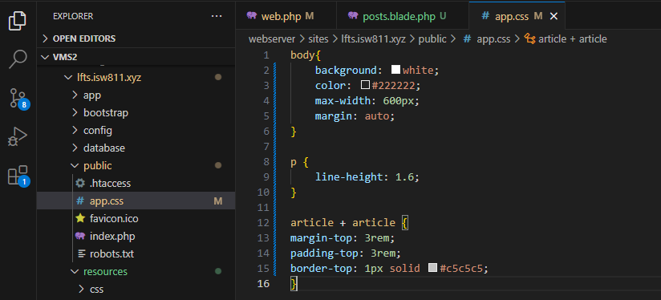

Hacemos los titulos de cada post cliqueables y con un link que redireccione a otra página

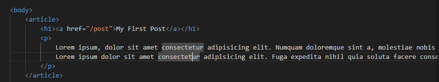

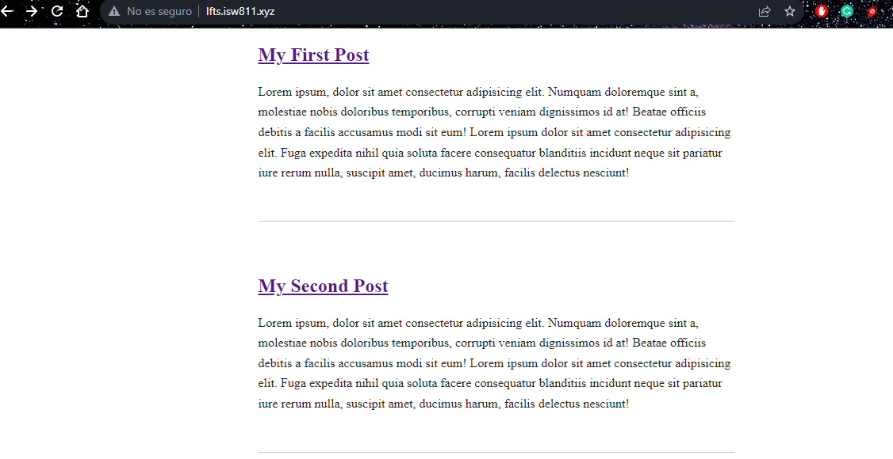

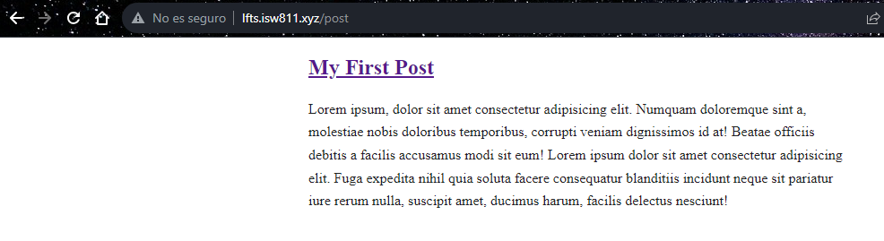

Esto se logra creando una nueva vista en la carpeta views

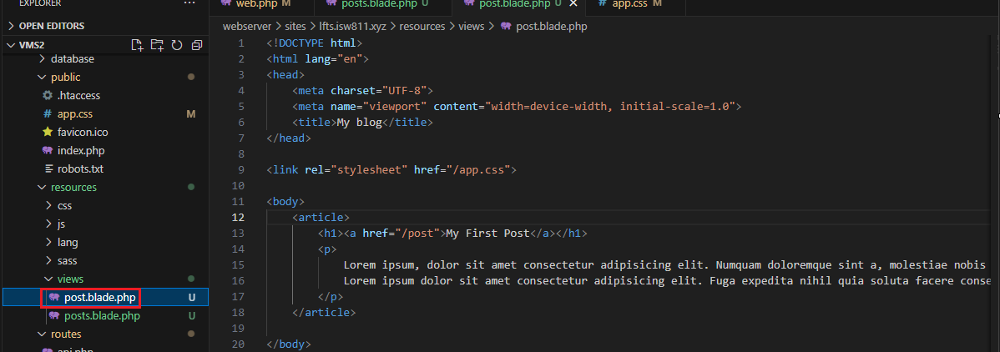

Y una nueva ruta en web.php

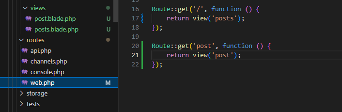

Una vez creada la nueva vista del post individual, creamos un boton para regresar al Home

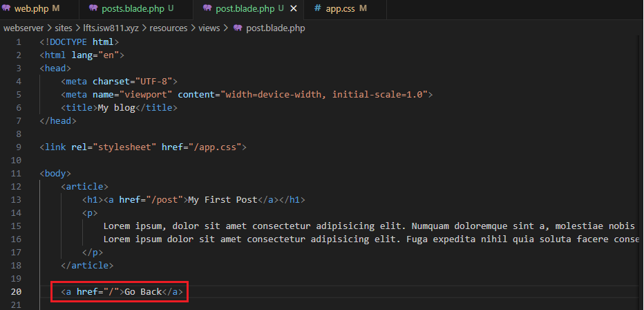

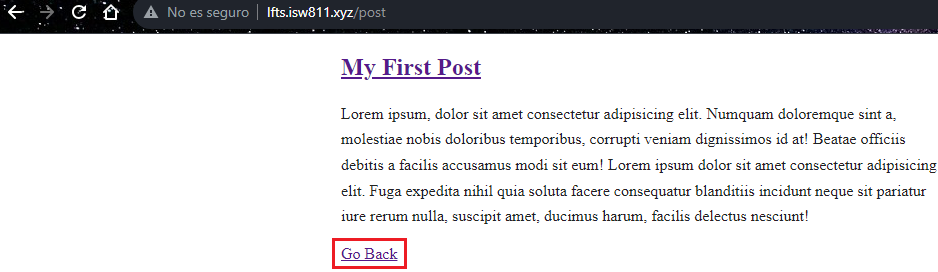

## Store Blog Posts as HTML Files

Creamos una variable $post que podamos llamar

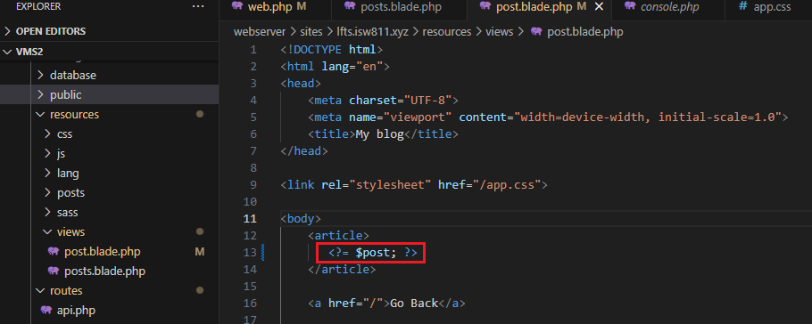

Creamos un folder llamado Posts con un archivo html por cada post

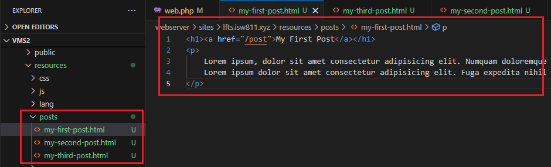

Pero para que funcione la variable $post debemos crearla en el archivo de rutas web.php cambiando un poco el get de la ruta, vamos a crear variables que obtengan la ruta del post seleccionado y vamos a evitar errores cuando se digite una ruta inexistente en la url

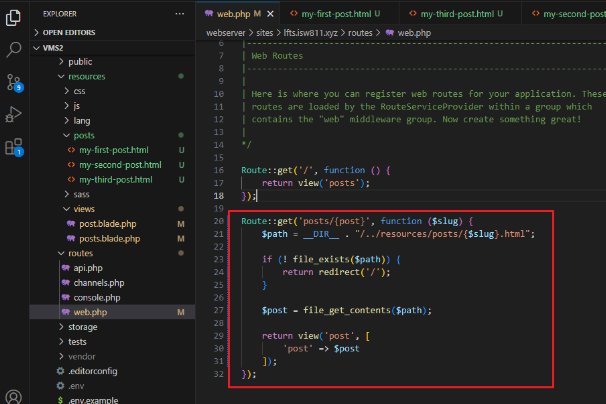

Antes de probar las rutas primero debemos modificarlas en el archivo posts.blade.php

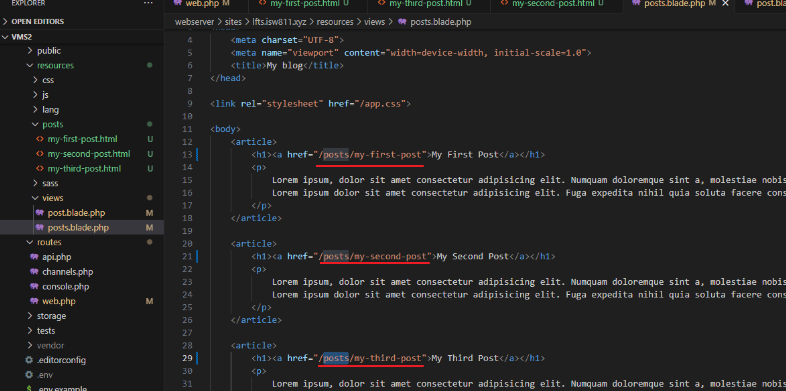

A nivel de la página se vería de la siguiente manera

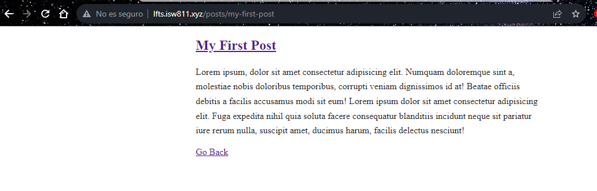

## Route Wildcard Constraints
Para delimitar lo que se puede o no poner en la ruta utilizamos un where para una expresión regular

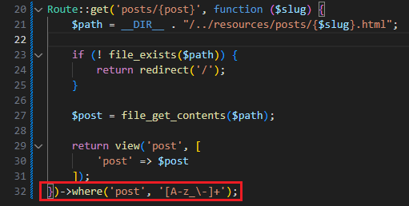

## Use Caching for Expensive Operations
Vamos a crear código para que cada vez que se acceda a la ruta nuevamente, la cargue desde la memoria cache y no tenga que pasar por el sistema de archivos en cada hit.

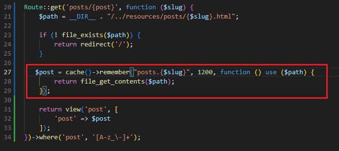

Así se vería el código de la ruta un poco mas limpio

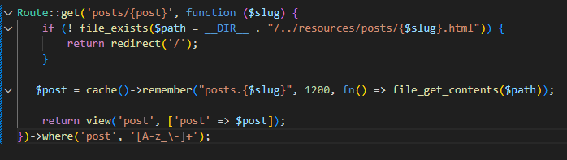

## Use the Filesystem Class to Read a Directory
Vamos a cambiar el codigo de la ruta para poder encontrar post especificos y pasarlos a la vista "post". Demos tomar en cuenta que la clase Post no está creada, es el siguiente paso.

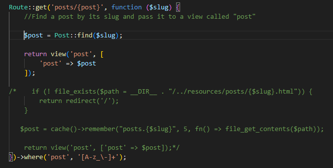

Creamos la clase o modelo Post dentro de la carpeta App / Models y llamamos al modelo desde route en web.php

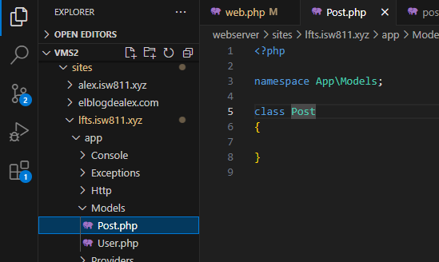

Llamado del modelo Post

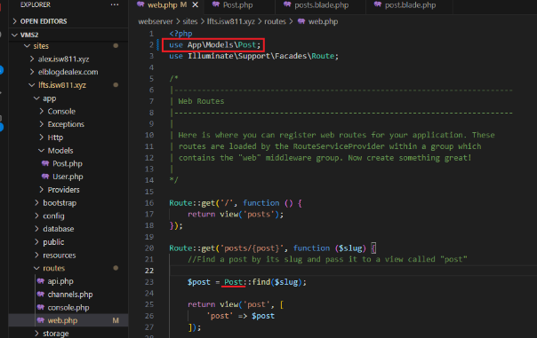

Ahora movemos el codigo anterior que teniamos en nuestro archivo de rutas(web.php) a la clase Post, con algunas modificaciones

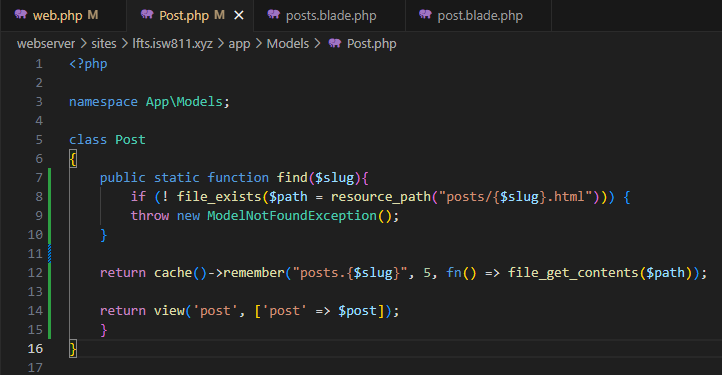

Y volvemos a modificar el archivo de rutas(web.php) para mejorar el codigo

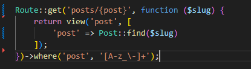

Modificamos los posts quemados anteriormente por el un foreach

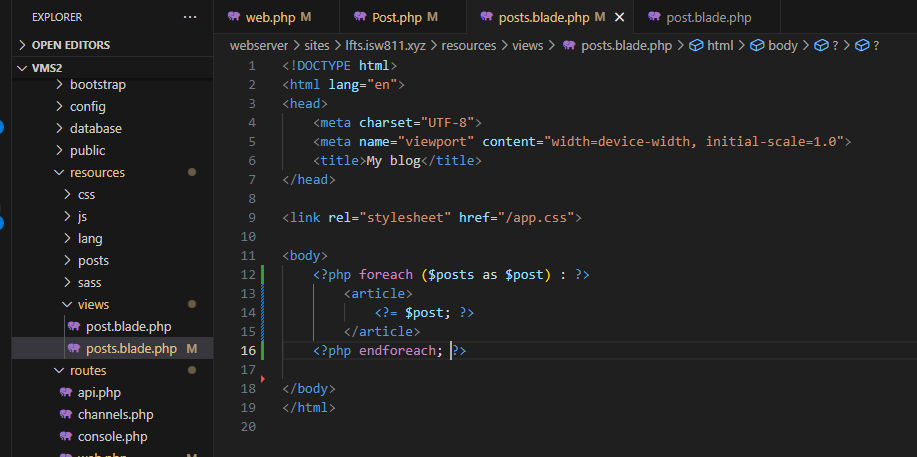

Luego modificamos en el archivo de rutas, la ruta del home

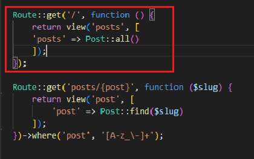

Y ya que no temos un metodo all, debemos crearlo

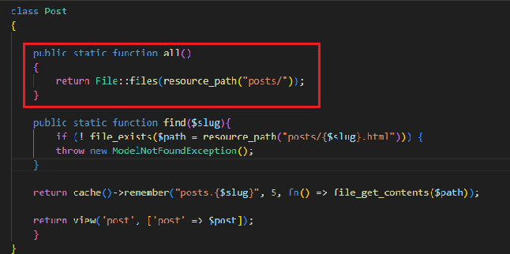

Asi se ve el home de momento

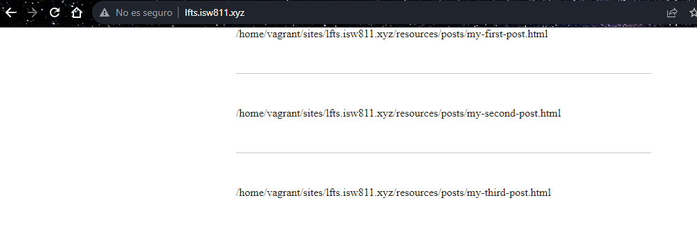


Por lo que tenemos que modificar el objeto all

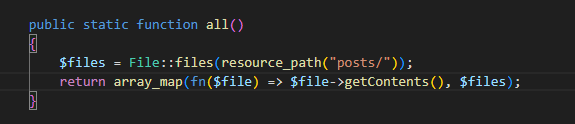

Y ya se verán nuestros posts

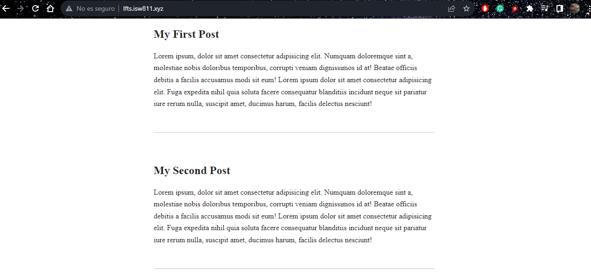

Agregamos un nuevo archivo post

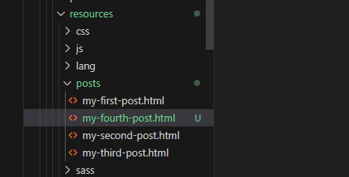

Y les colocamos metadata al inicio

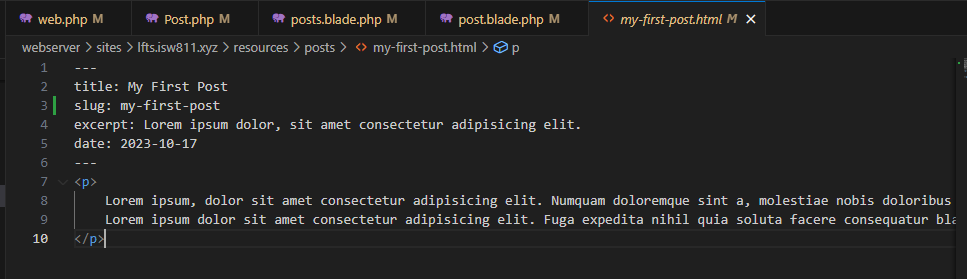

Vamos a instalar yaml-front-matter para manejar la metadata y el body
```bash
composer require spatie/yaml-front-matter
```

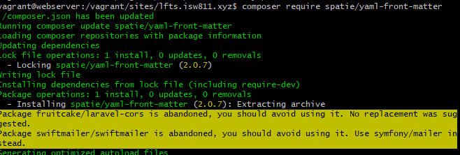

Se agregan variables, un constructor y se modifican los metodos all y find del post.php

```bash
<?php

namespace App\Models;

use Illuminate\Database\Eloquent\ModelNotFoundException;
use Illuminate\Support\Facades\File;
use Illuminate\Support\HigherOrderCollectionProxy;
use Spatie\YamlFrontMatter\YamlFrontMatter;
class Post
{
    public $title;
    public $excerpt;
    public $date;
    public $body;
    public $slug;
    public function __construct($title, $excerpt, $date, $body, $slug)
    {
        $this->title = $title;
        $this->excerpt = $excerpt;
        $this->date = $date;
        $this->body = $body;
        $this->slug = $slug;
    }

    public static function all()
    {
        return collect(File::files(resource_path("posts")))
        ->map(fn($file) => YamlFrontMatter::parseFile($file))
        ->map(fn($document) => new Post(
            $document->title,
            $document->excerpt,
            $document->date,
            $document->body(),
            $document->slug
        ));
    }

    public static function find($slug){
       return static::all()->firstWhere("slug", $slug);
    }
}
```

El web.php donde van nuestras rutas queda de la siguiente manera
```bash
<?php
use Illuminate\Support\Facades\Route;
use Spatie\YamlFrontMatter\YamlFrontMatter;
use App\Models\Post;

Route::get('/', function () {   
    return view('posts', [
        'posts' => Post::all()
    ]);
});

Route::get('posts/{post}', function ($slug) {    
    return view('post', [
        'post' => Post::find($slug)
    ]);
})->where('post', '[A-z_\-]+');
```

El posts.blade.php que carga nuestros posts, siendo este el home basicamente quedaria así
```bash
<!DOCTYPE html>

    <title>My blog</title>
    <link rel="stylesheet" href="/app.css">

<body>
    <?php foreach ($posts as $post) : ?>

        <article>
            <h1>
                <a href="/posts/<?= $post->slug; ?>">
                    <?= $post->title; ?>
                </a>
            </h1>

            <div>
                <?= $post->excerpt;?>
            </div>
        </article>

    <?php endforeach; ?>

</body>

```

Y para que cargue cada uno de los posts selecionados individualmente debemos tener nustro codigo en post.blade.php de la siguiente manera
```bash
<!DOCTYPE html>

    <title>My blog</title>
    <link rel="stylesheet" href="/app.css">

<body>
    <?php foreach ($posts as $post) : ?>

        <article>
            <h1>
                <a href="/posts/<?= $post->slug; ?>">
                    <?= $post->title; ?>
                </a>
            </h1>

            <div>
                <?= $post->excerpt;?>
            </div>
        </article>

    <?php endforeach; ?>

</body>
```

# Collection Sorting and Caching Refresher

Ahora vamos a acomodar los post por fecha de manera descendente y los vamos a guadar en la cache para que no tenga que cargar cada vez que se accede a la pagina 

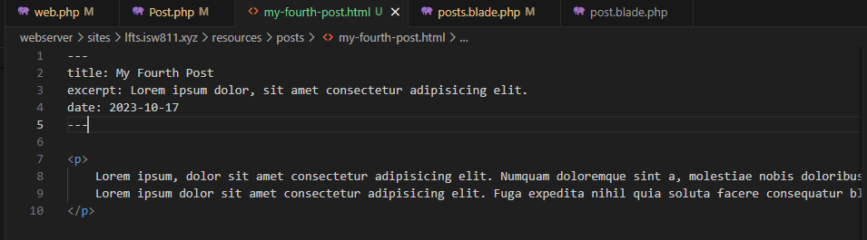

```bash
->sortBydesc('date');
```

Y para guardar en cache los post seria colocar todo el metodo all de la siguiente manera
```bash
 public static function all()
    {
        return cache()->rememberForever("posts.all", function () {
            return collect(File::files(resource_path("posts")))
            ->map(fn($file) => YamlFrontMatter::parseFile($file))
            ->map(fn($document) => new Post(
                $document->title,
                $document->excerpt,
                $document->date,
                $document->body(),
                $document->slug
            ))
            ->sortBydesc('date');
        }); 
    }
```
Para validar que si guarda los post en cache podemos acceder a ella por medio del siguente comando
```bash
php artisan tinker
```
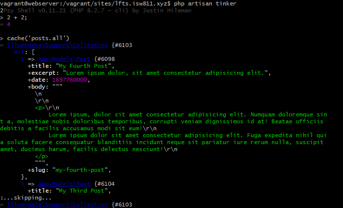

Para eliminar la cache ejecutamos el comando

```bash
cache()->forget('posts.all')
```
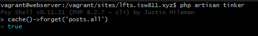

# Blade: The Absolute Basics
Blade es especifico para las vistas, nos facilita el codigo php dentro de ellas
```bash
Antes   -   <?= $post->title; ?>
Despues -   {{ $post->title }}
```
Asi quedaría la pagina de posts.blade.php y una vez aprendido esto podemos crear Layouts

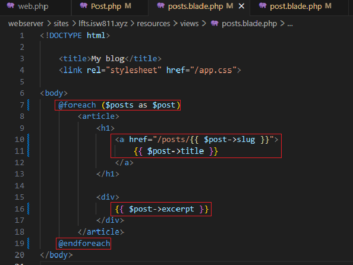

#

```bash

```


```bash

```


```bash

```


```bash

```