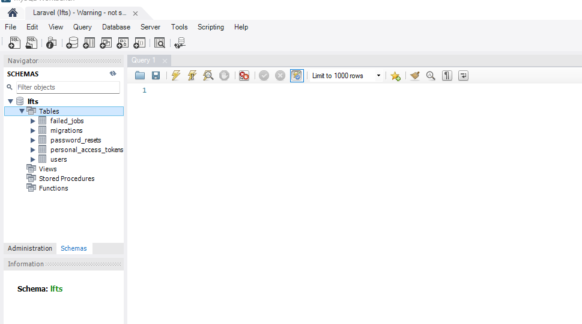
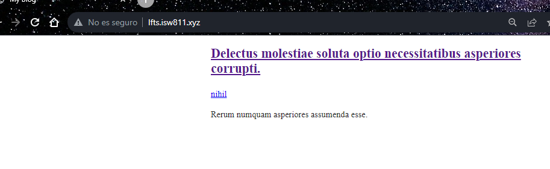

# Laravel From Scratch

## My first commit
Archivos base para empezar el curso LFTS a partir de la Section 2


## Include CSS and Javascript
Modificamos el welcom.blade.php que cargaba la vista basica de laravel creando nuestro propio código


Agregamos un archivo app.css para dar estilo por medio de css


Agregamos un archivo app.js para crear código javascript


## Make a Route and Link to it
Modificamos el nombre de la vista en la carpeta views y el llamado en el archivo web.php de la carpeta routes


Cambiamos el contenido del html de posts.blade.php


Junto con el css


Hacemos los titulos de cada post cliqueables y con un link que redireccione a otra página


Esto se logra creando una nueva vista en la carpeta views


Y una nueva ruta en web.php


Una vez creada la nueva vista del post individual, creamos un boton para regresar al Home


## Store Blog Posts as HTML Files

Creamos una variable $post que podamos llamar


Creamos un folder llamado Posts con un archivo html por cada post


Pero para que funcione la variable $post debemos crearla en el archivo de rutas web.php cambiando un poco el get de la ruta, vamos a crear variables que obtengan la ruta del post seleccionado y vamos a evitar errores cuando se digite una ruta inexistente en la url


Antes de probar las rutas primero debemos modificarlas en el archivo posts.blade.php


A nivel de la página se vería de la siguiente manera


## Route Wildcard Constraints
Para delimitar lo que se puede o no poner en la ruta utilizamos un where para una expresión regular


## Use Caching for Expensive Operations
Vamos a crear código para que cada vez que se acceda a la ruta nuevamente, la cargue desde la memoria cache y no tenga que pasar por el sistema de archivos en cada hit.


Así se vería el código de la ruta un poco mas limpio


## Use the Filesystem Class to Read a Directory
Vamos a cambiar el codigo de la ruta para poder encontrar post especificos y pasarlos a la vista "post". Demos tomar en cuenta que la clase Post no está creada, es el siguiente paso.


Creamos la clase o modelo Post dentro de la carpeta App / Models y llamamos al modelo desde route en web.php


Llamado del modelo Post


Ahora movemos el codigo anterior que teniamos en nuestro archivo de rutas(web.php) a la clase Post, con algunas modificaciones


Y volvemos a modificar el archivo de rutas(web.php) para mejorar el codigo


Modificamos los posts quemados anteriormente por el un foreach


Luego modificamos en el archivo de rutas, la ruta del home


Y ya que no temos un metodo all, debemos crearlo


Asi se ve el home de momento


Por lo que tenemos que modificar el objeto all


Y ya se verán nuestros posts


Agregamos un nuevo archivo post


Y les colocamos metadata al inicio


Vamos a instalar yaml-front-matter para manejar la metadata y el body
```bash
composer require spatie/yaml-front-matter
```


Se agregan variables, un constructor y se modifican los metodos all y find del post.php

```bash
<?php

namespace App\Models;

use Illuminate\Database\Eloquent\ModelNotFoundException;
use Illuminate\Support\Facades\File;
use Illuminate\Support\HigherOrderCollectionProxy;
use Spatie\YamlFrontMatter\YamlFrontMatter;
class Post
{
    public $title;
    public $excerpt;
    public $date;
    public $body;
    public $slug;
    public function __construct($title, $excerpt, $date, $body, $slug)
    {
        $this->title = $title;
        $this->excerpt = $excerpt;
        $this->date = $date;
        $this->body = $body;
        $this->slug = $slug;
    }

    public static function all()
    {
        return collect(File::files(resource_path("posts")))
        ->map(fn($file) => YamlFrontMatter::parseFile($file))
        ->map(fn($document) => new Post(
            $document->title,
            $document->excerpt,
            $document->date,
            $document->body(),
            $document->slug
        ));
    }

    public static function find($slug){
       return static::all()->firstWhere("slug", $slug);
    }
}
```

El web.php donde van nuestras rutas queda de la siguiente manera
```bash
<?php
use Illuminate\Support\Facades\Route;
use Spatie\YamlFrontMatter\YamlFrontMatter;
use App\Models\Post;

Route::get('/', function () {   
    return view('posts', [
        'posts' => Post::all()
    ]);
});

Route::get('posts/{post}', function ($slug) {    
    return view('post', [
        'post' => Post::find($slug)
    ]);
})->where('post', '[A-z_\-]+');
```

El posts.blade.php que carga nuestros posts, siendo este el home basicamente quedaria así
```bash
<!DOCTYPE html>

    <title>My blog</title>
    <link rel="stylesheet" href="/app.css">

<body>
    <?php foreach ($posts as $post) : ?>

        <article>
            <h1>
                <a href="/posts/<?= $post->slug; ?>">
                    <?= $post->title; ?>
                </a>
            </h1>

            <div>
                <?= $post->excerpt;?>
            </div>
        </article>

    <?php endforeach; ?>

</body>

```

Y para que cargue cada uno de los posts selecionados individualmente debemos tener nustro codigo en post.blade.php de la siguiente manera
```bash
<!DOCTYPE html>

    <title>My blog</title>
    <link rel="stylesheet" href="/app.css">

<body>
    <?php foreach ($posts as $post) : ?>

        <article>
            <h1>
                <a href="/posts/<?= $post->slug; ?>">
                    <?= $post->title; ?>
                </a>
            </h1>

            <div>
                <?= $post->excerpt;?>
            </div>
        </article>

    <?php endforeach; ?>

</body>
```

# Collection Sorting and Caching Refresher

Ahora vamos a acomodar los post por fecha de manera descendente y los vamos a guadar en la cache para que no tenga que cargar cada vez que se accede a la pagina 


```bash
->sortBydesc('date');
```

Y para guardar en cache los post seria colocar todo el metodo all de la siguiente manera
```bash
 public static function all()
    {
        return cache()->rememberForever("posts.all", function () {
            return collect(File::files(resource_path("posts")))
            ->map(fn($file) => YamlFrontMatter::parseFile($file))
            ->map(fn($document) => new Post(
                $document->title,
                $document->excerpt,
                $document->date,
                $document->body(),
                $document->slug
            ))
            ->sortBydesc('date');
        }); 
    }
```
Para validar que si guarda los post en cache podemos acceder a ella por medio del siguente comando
```bash
php artisan tinker
```


Para eliminar la cache ejecutamos el comando

```bash
cache()->forget('posts.all')
```


# Blade: The Absolute Basics
Blade es especifico para las vistas, nos facilita el codigo php dentro de ellas
```bash
Antes   -   <?= $post->title; ?>
Despues -   {{ $post->title }}
```
Asi quedaría la pagina de posts.blade.php y una vez aprendido esto podemos crear Layouts


# Blade: The Absolute Basics
Vamos a crear layouts para poder utilizarlos en nuestras vistas y asi no tener que hacer imports en cada view por cada nuevo archivo que vayamos a crear.

Creamos una nueva vista llamada layout.blade.php con el codigo
```bash
    @yield('content')
```


Al crear este layout, podemos modificar nuestro codigo del archivo posts.blade.php, quedando sin las etiquetas html y links.


El post.blade.php igualmente


Una manera alternativa de crear layouts es creando dentro de la carpeta views una subcarpeta llamada components, ahi metemos el archivo layout,blade.php y realizamos algunos cambios de codigo


# A Few Tweaks and Considerations

web.php
```bash
<?php
use Illuminate\Support\Facades\Route;
use Spatie\YamlFrontMatter\YamlFrontMatter;
use App\Models\Post;

Route::get('/', function () {   
    return view('posts', [
        'posts' => Post::all()
    ]);
});

Route::get('posts/{post}', function ($slug) {    
    return view('post', [
        'post' => Post::findOrFail($slug)
    ]);
});
```

post.php
```bash
<?php

namespace App\Models;

use Illuminate\Database\Eloquent\ModelNotFoundException;
use Illuminate\Support\Facades\File;
use Spatie\YamlFrontMatter\YamlFrontMatter;
class Post
{
    public $title;
    public $excerpt;
    public $date;
    public $body;
    public $slug;
    public function __construct($title, $excerpt, $date, $body, $slug)
    {
        $this->title = $title;
        $this->excerpt = $excerpt;
        $this->date = $date;
        $this->body = $body;
        $this->slug = $slug;
    }

    public static function all()
    {
        return cache()->rememberForever("posts.all", function () {
            return collect(File::files(resource_path("posts")))
            ->map(fn($file) => YamlFrontMatter::parseFile($file))
            ->map(fn($document) => new Post(
                $document->title,
                $document->excerpt,
                $document->date,
                $document->body(),
                $document->slug
            ))
            ->sortBydesc('date');
        }); 
    }

    public static function find($slug)
    {
        return static::all()->firstWhere("slug", $slug);
    }

    public static function findOrFail($slug)
    {
        $post = static::find($slug);

        if (! $post) {
        throw new ModelNotFoundException();
        }
        return $post;
    }
}
```

# Environment Files and Database Connections

Realizamos la migracion de la BD, configurando el .env


Y ejecutando el comando
```bash
php artisan migrate
```




# Make a Post Model and Migration
Borramos el modelo Post.php porque ahora vamos a transicionar a un post con Eloquent Model.

Creamos la migracion de los posts


```bash
php artisan make:migration create_posts_table
```


Borramos la carpeta con los post creados manualmente y modificamos la migracion de create_posts_table para que cuente con los campos que necesitamos


Debemos crear un Eloquent Model 
```bash
php artisan make:model Post 
```


Con php atrtisan tinker creamos un post


```bash
php artisan tinker

new App\Models\Post;

$post = new App\Models\Post;

$post->slug = 'my-first-post';

$post->title = 'My First Post';

$post->excerpt = 'Lorem ipsum dolar sit amet consectetur adipisicing elit.';

$post->body = 'Lorem ipsum, dolor sit amet consectetur adipisicing elit. Expedita accusamus quaerat aliquid incidunt nihil iste sed velit ipsam, suscipit molestias dicta fugiat odio officia omnis reprehenderit minus quidem minima.odio officia omnis reprehenderit minus';

$post->save();
```


```bash
use App\Models\Post;
Post::count();
```


## Asi se va viendo el site


# Eloquent Updates and HTML Escaping
Actualizacion de blog post existente, cambiamos el body a html
```bash
php artisan tinker
$post = App\Models\Post::first();
$post->body;
$post->body = '<p>' . $post->body . '</p>'
$post
$post->save();

$post = App\Models\Post::find(2); //Para actualizar los demas por id
```

# 3 Ways to Mitigate Mass Assignment Vulnerabilities
 1- Para asignar en masa un post como en el codigo de abajo, debemos tener en cuenta la seguridad, por eso solo vamos a permitir que se asignen los datos deseados en el archivo Post.php

```bash
Post::create(['title' => 'My Fourth Post', 'excerpt' => 'Lorem ipsum dolar sit amet consectetur adipisicing elit.', 'body' => 'Lorem ipsum, dolor sit amet consectetur adipisicing elit. Expedita accusamus quaerat aliquid incidunt nihil iste sed velit ipsam, suscipit molestias dicta fugiat odio officia omnis reprehenderit minus quidem minima.odio officia omnis reprehenderit minus quidem minima.' ]);
```
Archivo Post.php, si se agregan mas datos en el inster masivo entonces laravel lo rechaza


2- Por medio de protected podemos evitar que se agreguen datos indeseados como puede ser el id del post, entonces a la hora de hacer el mass asign con un id, el sistema si crea el post pero ignorando el id.


3- La tarcera opcion es nunca permitir el mass asign, simplemente dejando el array vacio


# Route Model Binding
Le agregamos al archivo de migration, una variable slug
```bash
public function up()
    {
        Schema::create('posts', function (Blueprint $table) {
            $table->id();
            $table->string('slug')->unique();
            $table->string('title');
            $table->string('excerpt');
            $table->string('body');
            $table->timestamps();
            $table->timestamp('published_at')->nullable();
        });
    }
```

Luego en nuestro archivo de rutas web.php modificamos el get de los posts quedando así

```bash
Route::get('posts/{post:slug}', function (Post $post) {    
    return view('post', [
        'post' => $post
    ]);
});
```

# Your First Eloquent Relationship
Vamos a agregar una categoria a cada post

Creacion de modelo y su migration
```bash
php artisan make:model Category -m
```


Creamos varias categorias despues de ralizar un php artisan migrate:fresh
```bash
php artisan tinker
use App\Models\Category;
$c = new Category;
$c->name = 'Personal';
$c->slug = 'personal';
$c->save();
```


Ahora vamos a crear posts
```bash
use App\Models\Post;
Post::create([
    'title' => 'My Hobby Post',
    'excerpt' => 'Excerpt for my post',
    'body' => 'Lorem ipsum dolar sit amet ameis og.',
    'slug' => 'my-hobby-post',
    'category_id' => 3
]);
```
Nuestro Post.php se veria asi, lo que quiere decir que ahora tenemos nuestra primera Eloquent Relationship
```bash
<?php

namespace App\Models;

use Illuminate\Database\Eloquent\Factories\HasFactory;
use Illuminate\Database\Eloquent\Model;

class Post extends Model
{
    use HasFactory;

    protected $guarded = [];
    public function category()
    {
        return $this->belongsTo(Category::class);
    }
}
```

Agregamos a nuestro post.blade.php y posts.blade.php el siguiente codigo para poder ver las categorias
```bash
<p>
    <a href="#">{{ $post->category->name }}</a>
</p>
```


# Show All Posts Associated With a Category
Agregamos un nuevo metodo a Web.php
```bash
Route::get('categories/{category:slug}', function (Category $category) {    
    return view('posts', [
        'posts' => $category->posts
    ]);
});
```
Agregamos una nueva funcion a nuestro Category.php
```bash
public function posts()
    {
        return $this->hasMany(Post::class);
    }
```

En post.blade.php y posts.blade.php colocamos el link de la categoria de esta manera
```bash
<a href="/categories/{{ $post->category->slug }}">{{ $post->category->name }}</a>
```

# Clockwork, and the N+1 Problem
Para no ejecutar un query cada vez que se carga una categoria vamos a resolverlo de esta manera
 
Para esto debemos modificar el get de los posts
```bash
Route::get('/', function () {   
    return view('posts', [
        'posts' => Post::with('category')->get()
    ]);
});
```

# Database Seeding Saves Time

Agregamos un nuevo campo a la migration de posts
```bash
public function up()
    {
        Schema::create('posts', function (Blueprint $table) {
            $table->id();
            $table->foreignId('user_id');
            $table->foreignId('category_id');
            $table->string('slug')->unique();
            $table->string('title');
            $table->string('excerpt');
            $table->string('body');
            $table->timestamps();
            $table->timestamp('published_at')->nullable();
        });
    }
```

Accedemos al archivo de la carpeta seeder y creamos lo siguiente


Corremos el migrate seed para actualizar la BD y repoblarla
```bash
php artisan migrate:fresh --seed
```

Actualizamos el databaseseeder y aplicamos php artisan migrate:fresh --seed
```bash
<?php

namespace Database\Seeders;

use App\Models\Category;
use App\Models\Post;
use App\Models\User;
use Illuminate\Database\Seeder;

class DatabaseSeeder extends Seeder
{
    /**
     * Seed the application's database.
     *
     * @return void
     */
    public function run()
    {
        User::truncate();
        Category::truncate();  
        Post::truncate();

        $user = User::Factory()->create();

        $personal = Category::create([
            'name' => 'Personal',
            'slug' => 'personal',
        ]);

        $family = Category::create([
            'name' => 'Family',
            'slug' => 'family',
        ]);

        $work = Category::create([
            'name' => 'Work',
            'slug' => 'work',
        ]);

        Post::create([
            'user_id'=> $user->id,
            'category_id' => $family->id,
            'title' => 'My Family Post',
            'slug' => 'my-family-post',
            'excerpt' => '<p>Lorem ipsum, dolor sit amet consectetur adipisicing elit.</p>',
            'body' => '<p>Lorem ipsum, dolor sit amet consectetur adipisicing elit. Expedita accusamus quaerat aliquid incidunt nihil iste sed velit ipsam, suscipit molestias dicta fugiat odio officia omnis reprehenderit minus quidem minima.odio officia</p>',
        ]);

        Post::create([
            'user_id'=> $user->id,
            'category_id' => $work->id,
            'title' => 'My Work Post',
            'slug' => 'my-work-post',
            'excerpt' => '<p>Lorem ipsum, dolor sit amet consectetur adipisicing elit.</p>',
            'body' => '<p>Lorem ipsum, dolor sit amet consectetur adipisicing elit. Expedita accusamus quaerat aliquid incidunt nihil iste sed velit ipsam, suscipit molestias dicta fugiat odio officia omnis reprehenderit minus quidem minima.odio officia</p>',
        ]);

    }
}
```
# Turbo Boost With Factories

Creamos un post de factory
```bash
php artisan make:factory PostFactory
```
Lo modificamos


Creamos un factory CategoryFactory
```bash
php artisan make:factory CategoryFactory;
```

Y lo modificamos
```bash
public function definition()
    {
        return [
            'name' => $this->faker->word,
            'slug'=> $this->faker->slug,
        ];
    }
```

Tambien modificamos el postFactory
```bash
public function definition()
    {
        return [
            'user_id' => User::factory(),
            'category_id' => Category::factory(),
            'title' => $this->faker->sentence,
            'slug'=> $this->faker->slug,
            'excerpt' => $this->faker->sentence,
            'body' => $this->faker->paragraph
        ];
    }
```
Ingresamos a tinker
```bash
php artisan tinker
App\Models\Post::factory()->create();
```


Modificamos nuevamente el databaseSeeder
```bash
<?php

namespace Database\Seeders;

use App\Models\Category;
use App\Models\Post;
use App\Models\User;
use Illuminate\Database\Seeder;

class DatabaseSeeder extends Seeder
{
    /**
     * Seed the application's database.
     *
     * @return void
     */
    public function run()
    {
        Post::factory()->create();
    }
}
```

Ejecutamos el comando
```bash
php artisan db:seed
```

Y ya podemos ver un post creado automaticamente en todos sus campos




Modificamos nuevamente el databaseSeeder para que el usuario siempre sea Alex Cruz
```bash
<?php

namespace Database\Seeders;

use App\Models\Category;
use App\Models\Post;
use App\Models\User;
use Illuminate\Database\Seeder;

class DatabaseSeeder extends Seeder
{
    /**
     * Seed the application's database.
     *
     * @return void
     */
    public function run()
    {
        $user = User::factory()->create([
            'name' => 'Alex Cruz',
        ]);


        Post::factory(5)->create([
            'user_id'=> $user->id,
        ]);
    }
}
```


En cada cambio se recomienda correr
```bash
php artisan migrate:fresh --seed
```

# View All Posts By An Author
En web.phph modificamos el get home posts para que los acomode de manera desc
```bash
Route::get('/', function () {   
    return view('posts', [
        'posts' => Post::latest()->with('category')->get()
    ]);
});
```
En web.php creamos una ruta para poder traer todos los post de un autor
```bash
Route::get('authors/{author}', function (User $author) {    
    return view('posts', [
        'posts' => $author->posts
    ]);
});
```

Para evitar utilizar el id vamos a crear lo siguiente.
Primero agregamos un username a la migracion de user
```bash
 $table->string('username')->unique();
```

En userfactory tambien agregamos el campo
```bash
'username' => $this->faker->unique()->username,
```

El metodo en web.php quedaria de la siguiente manera

```bash
Route::get('authors/{author:username}', function (User $author) {    
    return view('posts', [
        'posts' => $author->posts
    ]);
});
```

Corremos el migrate
```bash
php artisan migrate:fresh --seed
```

Y asi se ve la pagina


# Eager Load Relationships on an Existing Model

Agregamos a post.php el siguiente codigo que sirve por defecto para cada post query que se realice
```bash
    protected $with = ['category', 'author'];
```
A raiz de esa linea entonces nuestro archivo de rutas web.php puede verse asi
```bash
<?php
use App\Models\Category;
use App\Models\User;
use Illuminate\Support\Facades\Route;
use App\Models\Post;

Route::get('/', function () {   
    return view('posts', [
        'posts' => Post::latest()->get()
    ]);
});

Route::get('posts/{post:slug}', function (Post $post) {    
    return view('post', [
        'post' => $post
    ]);
});

Route::get('categories/{category:slug}', function (Category $category) {    
    return view('posts', [
        'posts' => $category->posts
    ]);
});

Route::get('authors/{author:username}', function (User $author) {    
    return view('posts', [
        'posts' => $author->posts
    ]);
});
```
# Convert the HTML and CSS to Blade
Descargamos el repositorio de git y pegamos el contenido del index en nuestro layout.blade.php de la carpeta components
Pasamos la carpeta de imagenes a nuestro public y nada mas cambiamos las rutas del index y vemos la pagina asi


Editamos el layout con el html del index que descargamos


Igualmente el post

