# Workshop 4 - XXXX

## Agregar memoria suficiente a la VM
```bash
config.vm.provider "virtualbox" do |vb|
     vb.memory = "2048"
  end
```
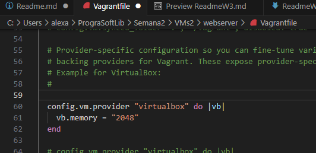

Reiniciar la VM despues de aplicar este cambio al Vagrantfile

## Crear una segunda VM
```bash
mkdir database
cd database
$ vagrant init debian/bullworm64
```
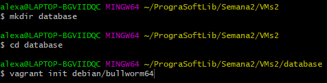

## Verificamos los archivos de la carpeta DB para validar que cuente con el vagrantfile
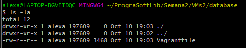
```bash
ls -ls
```

## Abrir el vagrantfile para configurar la IP
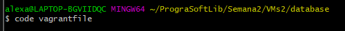
```bash
code vagrantfile
```
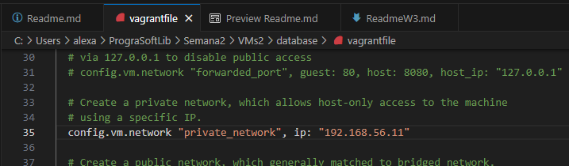

## Iniciar la nueva VM
```bash
vagrant up
vagrant ssh
```
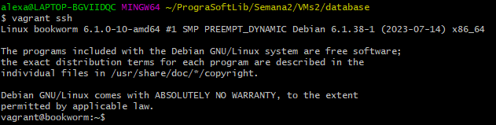

## Modificar el nombre de la VM
```bash
sudo hostnamectl set-hostname database
```
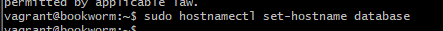

## Corregir la entrada que del archivo host para que coincida con el nuevo nombre del host
```bash
sudo nano /etc/hosts
```
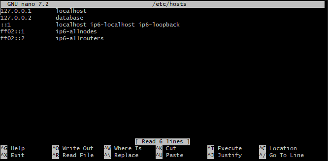

## Para verificar el nuevo cambio salimos y volvemos a conectar
```bash
exit
vagrant ssh
```
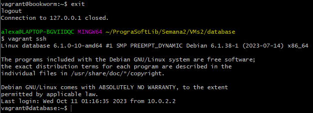

## Instalar los paquetes de MariaDB para que la maquina sirva como BD
```bash
sudo apt-get update
```
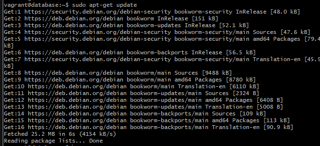

```bash
sudo apt-get install mariadb-server mariadb-client
```
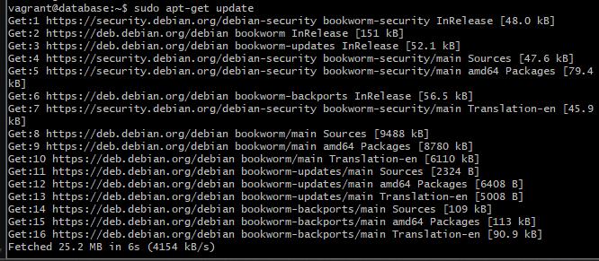

## Eliminar las funciones de servidor de la BD de la maquina webserver
Debemos salir de database e ingresar a webserver para levantar ahi la VM y correr el comando

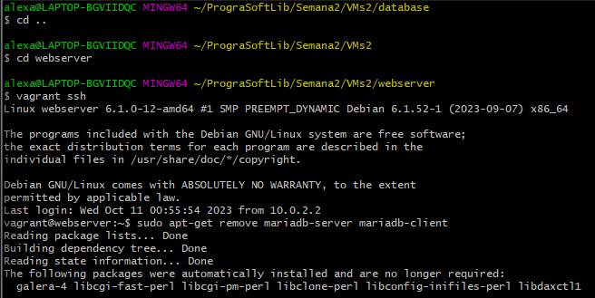
```bash
sudo apt-get remove mariadb-server mariadb-client
```
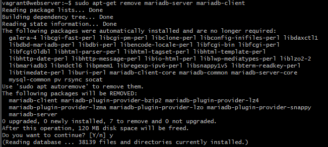

## Crear un usuario y una BD para utilizar en el desarrollo del curso LFTS
Ingresar y levantar database

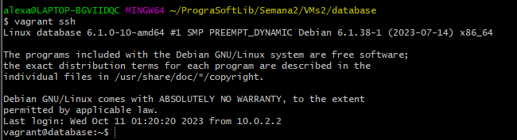

Dentro de database corremos sudo mysql

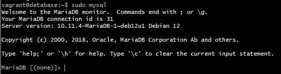

## Creacion de las credenciales de la BD
```bash
create user laravel identified by 'seceret';
create database lfts;
grant all privileges on lfts.* to laravel;
flush privileges;
quit
```
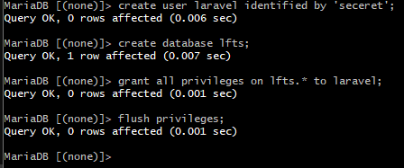

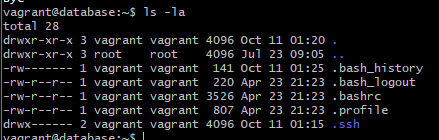

## Comprobar que hicimos el password y el grant correctamente
```bash
mysql -u laravel -p;
```
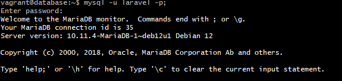
```bash
 show databases;
```
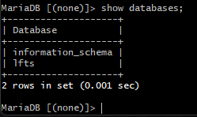


# Habilitar el acceso remoto a la BD 'MariaDB'

Para que se pueda conectar desde una maquina externa. 
```bash
sudo nano -l /etc/mysql/mariadb.conf.d/50-server.cnf
```
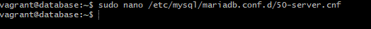
Comentamos la linea del bind-address y salvamos con [Ctrl+O] y salimos del editor con [Ctrl+X]


## Reiniciamos y salimos
```bash
sudo systemctl restart mysql
exit
```
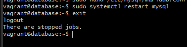

## Comprobamos el acceso remoto a la BD desde webserver
```bash
mysql -h 192.168.56.11 -u laravel -p
```
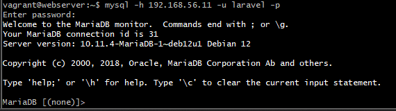
```bash
show databases;
```
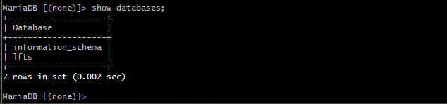

### Comprobamos nuevamente que podemos ver y conectar a la BD

```bash
sudo apt-get install mariadb-client
mysql -u laravel -h 192.168.56.11 -p
```
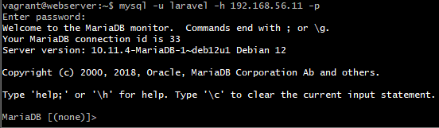

# Instalacion de workbench y crear una nueva conexion
Descargar aqui [Workbench](https://dev.mysql.com/downloads/workbench/ "Workbench download").


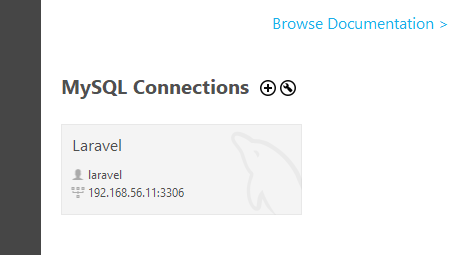

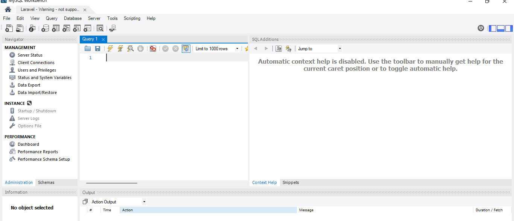

## Habilitamos el schema lfts para conectarnos a la BD lfts


# Habilitar autenticacion con Laravel/UI
Vamos a necesitar node y npm. Para esto vamos a instalar nvm, que es un admin de versiones para node.js.

```bash
curl -o- https://raw.githubusercontent.com/nvm-sh/nvm/v0.39.5/install.sh | bash
```
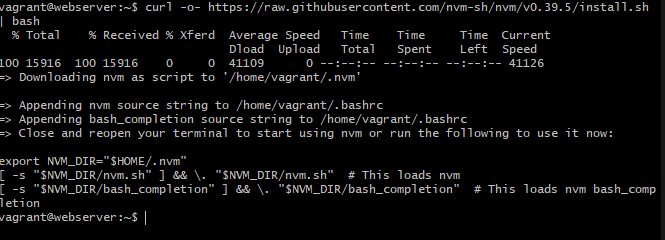

Salir de la mquina y volver a ingresar para probar el comando nvm
```bash
exit
vagrant ssh
nvm
```
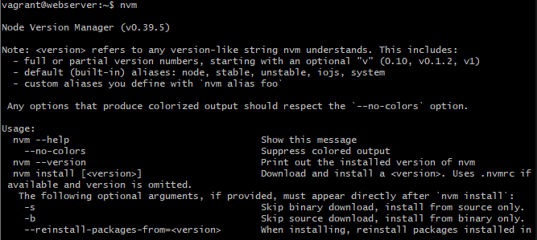

Instalar Node.js, con el siguiente comando podemos listar kas versiones disponibles de node.js, y con el comando 'nvm install --lts=hydrogen' instalamos la version estable con el nombre clave Hydrogen(Compatible con Laravel 6.8.12)
```bash
nvm ls-remote
```
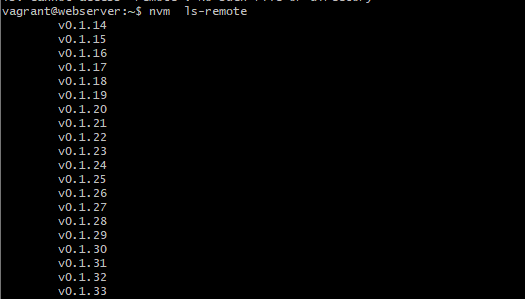


```bash
nvm install --lts=hydrogen
```
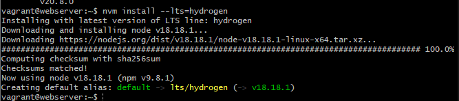


# Instalar laravel UI
Primero requerimos Composer y node.js

Ingresamos a sites/lfts
```bash
cd /vagrant/sites/lfts.isw811.xyz/
```
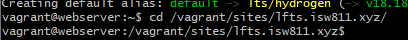

Luego descargamos la version
```bash
composer require laravel/ui:3.4.6
```
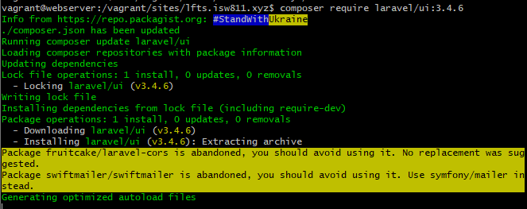


```bash
php artisan ui bootstrap
```

```bash
npm install && npm run dev
npm install && npm run dev #este comando se ejecuta dos veces
```

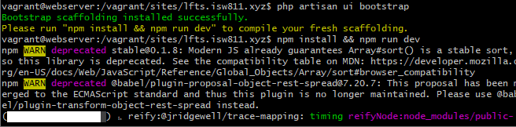


## Descagar las dependencias y agregarlas a nuestro package.json
```bash
cat package.json
```
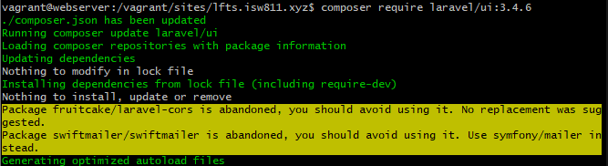

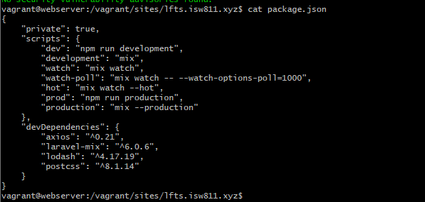

## Creamos las vistas de autenticacion
```bash
 php artisan ui bootstrap
 npm install && npm run dev
```

## Modificar el archivo .env de la raiz de lfts
```bash
vim .env
```
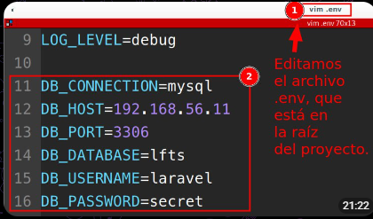

## Se debe craftear la BD desde el proyecto

Nos conectamos desde vagrant ssh
```bash
vagrant ssh
php artisan migrate
```

# Iniciar curso de laravel en la seccion 2
Comandos para documentar avances en git
```bash
git init -> Para iniciar el git
git log
ls .gitignore
git add. git commit -m "Mi primer commit" -> Para iniciar el primer commit
git status -> para ver los cambios
```
Omitir capetas vendor, estar ubicados en git
```bash
mkdir docs
code README.md -> Crear aqui el registro del avance en el curso, crear un nuevo archivo .md por cada modulo
```


```bash
```